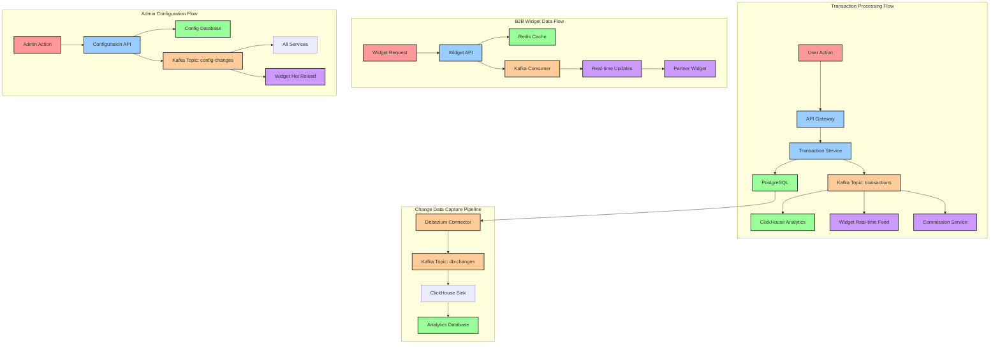
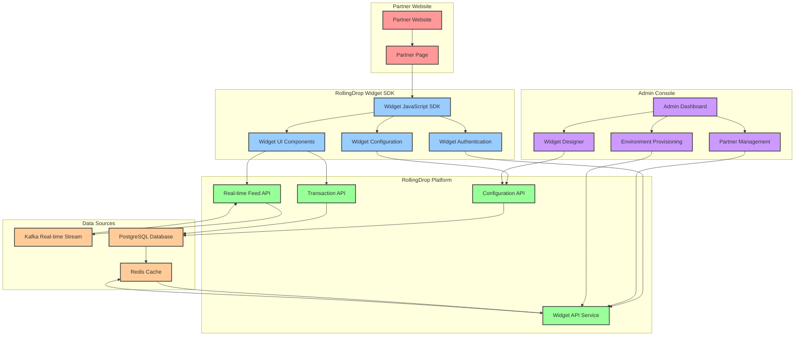
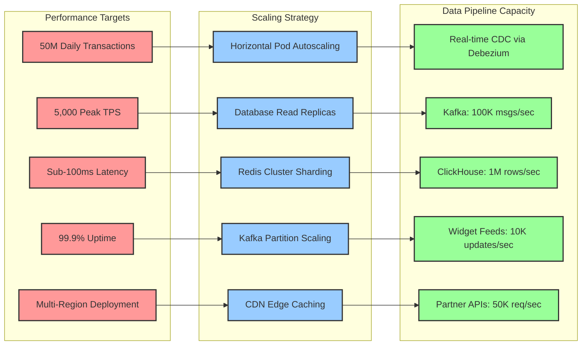

# RollingDrop Application Architecture Diagram
## High-Scale B2B/B2C Platform (50M+ Daily Transactions)

```mermaid
graph TB
    %% External Systems
    subgraph "External Systems"
        B2B[B2B Partner Sites]
        WL[Whitelabel Platforms]
        MOBILE[Mobile Apps]
        WEB[Web Clients]
    end

    %% CDN & Load Balancer
    subgraph "Edge Layer"
        CDN[CDN / CloudFlare]
        LB[Load Balancer]
        WAF[Web Application Firewall]
    end

    %% API Gateway Layer
    subgraph "API Gateway Layer"
        APIGW[API Gateway / Kong]
        WIDGET_GW[Widget Gateway]
        PARTNER_GW[Partner API Gateway]
        WL_GW[Whitelabel Gateway]
    end

    %% Frontend Layer
    subgraph "Frontend Layer"
        REACT[React SPA]
        ADMIN[Admin Console]
        WIDGET_SDK[Widget SDK Library]
        WL_UI[Whitelabel UI Framework]
    end

    %% Core Services Layer
    subgraph "Core Microservices"
        AUTH[Authentication Service]
        TRANS[Transaction Engine]
        INV[Inventory Service]
        CONFIG[Configuration Service]
        WIDGET[Widget Framework Service]
        WL_MGR[Whitelabel Manager]
        PROVISION[Environment Provisioning]
    end

    %% Supporting Services
    subgraph "Supporting Services"
        ANALYTICS[Analytics Service]
        NOTIFICATION[Notification Service]
        PAYMENT[Payment Gateway Service]
        FRAUD[Fraud Detection Service]
        COMMISSION[Commission Engine]
    end

    %% Message Streaming Layer
    subgraph "Message Streaming (Kafka Cluster)"
        KAFKA_BROKER1[Kafka Broker 1]
        KAFKA_BROKER2[Kafka Broker 2]
        KAFKA_BROKER3[Kafka Broker 3]
        SCHEMA_REG[Schema Registry]
        DEBEZIUM[Debezium CDC]
    end

    %% Data Layer
    subgraph "Primary Data Layer (OLTP)"
        PG_MASTER1[PostgreSQL Master 1]
        PG_MASTER2[PostgreSQL Master 2]
        PG_REPLICA1[PostgreSQL Replica 1]
        PG_REPLICA2[PostgreSQL Replica 2]
        PG_REPLICA3[PostgreSQL Replica 3]
        
        MONGO_SHARD1[MongoDB Shard 1]
        MONGO_SHARD2[MongoDB Shard 2]
        MONGO_SHARD3[MongoDB Shard 3]
        
        REDIS_CLUSTER[Redis Cluster]
    end

    %% Analytics Layer
    subgraph "Analytics Data Layer (OLAP)"
        CLICKHOUSE1[ClickHouse Node 1]
        CLICKHOUSE2[ClickHouse Node 2]
        CLICKHOUSE3[ClickHouse Node 3]
        INFLUXDB[InfluxDB Time Series]
    end

    %% Monitoring & Operations
    subgraph "Monitoring & Operations"
        PROMETHEUS[Prometheus]
        GRAFANA[Grafana]
        JAEGER[Jaeger Tracing]
        ELK[ELK Stack]
        ALERTING[AlertManager]
    end

    %% Kubernetes Platform
    subgraph "Kubernetes Platform"
        K8S_MASTER[K8s Control Plane]
        K8S_NODES[K8s Worker Nodes]
        ISTIO[Istio Service Mesh]
        INGRESS[Ingress Controller]
    end

    %% External Integrations
    subgraph "External Integrations"
        STRIPE[Stripe Payment]
        AWS_S3[AWS S3 Storage]
        SENDGRID[SendGrid Email]
        CLOUDFLARE[Cloudflare DNS]
    end

    %% Connection Flow - External to Edge
    B2B --> CDN
    WL --> CDN
    MOBILE --> CDN
    WEB --> CDN
    
    CDN --> WAF
    WAF --> LB
    
    %% Edge to Gateway
    LB --> APIGW
    LB --> WIDGET_GW
    LB --> PARTNER_GW
    LB --> WL_GW
    
    %% Gateway to Frontend
    APIGW --> REACT
    APIGW --> ADMIN
    WIDGET_GW --> WIDGET_SDK
    WL_GW --> WL_UI
    
    %% Frontend to Services
    REACT --> AUTH
    REACT --> TRANS
    REACT --> INV
    ADMIN --> CONFIG
    ADMIN --> WIDGET
    ADMIN --> WL_MGR
    ADMIN --> PROVISION
    
    %% Widget SDK Connections
    WIDGET_SDK --> WIDGET
    WIDGET_SDK --> TRANS
    WIDGET_SDK --> INV
    
    %% Core Service Interactions
    AUTH --> REDIS_CLUSTER
    TRANS --> PG_MASTER1
    TRANS --> PG_MASTER2
    INV --> MONGO_SHARD1
    INV --> MONGO_SHARD2
    INV --> MONGO_SHARD3
    CONFIG --> PG_REPLICA1
    CONFIG --> REDIS_CLUSTER
    
    %% Supporting Services
    TRANS --> PAYMENT
    TRANS --> FRAUD
    TRANS --> COMMISSION
    CONFIG --> ANALYTICS
    WIDGET --> NOTIFICATION
    
    %% Kafka Integration
    TRANS --> KAFKA_BROKER1
    INV --> KAFKA_BROKER2
    ANALYTICS --> KAFKA_BROKER3
    DEBEZIUM --> PG_MASTER1
    DEBEZIUM --> PG_MASTER2
    DEBEZIUM --> KAFKA_BROKER1
    
    %% Analytics Pipeline
    KAFKA_BROKER1 --> CLICKHOUSE1
    KAFKA_BROKER2 --> CLICKHOUSE2
    KAFKA_BROKER3 --> CLICKHOUSE3
    ANALYTICS --> INFLUXDB
    
    %% Read Replicas
    CONFIG --> PG_REPLICA2
    ANALYTICS --> PG_REPLICA3
    WIDGET --> PG_REPLICA1
    
    %% Monitoring Connections
    K8S_NODES --> PROMETHEUS
    PROMETHEUS --> GRAFANA
    ISTIO --> JAEGER
    K8S_NODES --> ELK
    PROMETHEUS --> ALERTING
    
    %% External Service Connections
    PAYMENT --> STRIPE
    WIDGET --> AWS_S3
    NOTIFICATION --> SENDGRID
    WL_MGR --> CLOUDFLARE

    %% Styling
    classDef external fill:#ff9999,stroke:#333,stroke-width:2px
    classDef edge fill:#99ccff,stroke:#333,stroke-width:2px
    classDef gateway fill:#99ff99,stroke:#333,stroke-width:2px
    classDef frontend fill:#ffcc99,stroke:#333,stroke-width:2px
    classDef core fill:#cc99ff,stroke:#333,stroke-width:2px
    classDef support fill:#ffff99,stroke:#333,stroke-width:2px
    classDef data fill:#99ffcc,stroke:#333,stroke-width:2px
    classDef analytics fill:#ff99cc,stroke:#333,stroke-width:2px
    classDef monitor fill:#cccccc,stroke:#333,stroke-width:2px
    classDef k8s fill:#ccffcc,stroke:#333,stroke-width:2px
    classDef kafka fill:#ffccff,stroke:#333,stroke-width:2px

    class B2B,WL,MOBILE,WEB external
    class CDN,LB,WAF edge
    class APIGW,WIDGET_GW,PARTNER_GW,WL_GW gateway
    class REACT,ADMIN,WIDGET_SDK,WL_UI frontend
    class AUTH,TRANS,INV,CONFIG,WIDGET,WL_MGR,PROVISION core
    class ANALYTICS,NOTIFICATION,PAYMENT,FRAUD,COMMISSION support
    class PG_MASTER1,PG_MASTER2,PG_REPLICA1,PG_REPLICA2,PG_REPLICA3,MONGO_SHARD1,MONGO_SHARD2,MONGO_SHARD3,REDIS_CLUSTER data
    class CLICKHOUSE1,CLICKHOUSE2,CLICKHOUSE3,INFLUXDB analytics
    class PROMETHEUS,GRAFANA,JAEGER,ELK,ALERTING monitor
    class K8S_MASTER,K8S_NODES,ISTIO,INGRESS k8s
    class KAFKA_BROKER1,KAFKA_BROKER2,KAFKA_BROKER3,SCHEMA_REG,DEBEZIUM kafka
```

## Data Flow Architecture

## B2B Widget Integration Architecture

## Performance & Scaling Targets

## Key Architecture Benefits

### Scalability
- **Horizontal scaling** across all service layers
- **Database sharding** for 50M+ daily transactions
- **Kafka partitioning** for high-throughput message streaming
- **Redis clustering** for distributed caching

### B2B Integration
- **Widget SDK** for easy partner integration
- **Real-time data feeds** via Kafka streams
- **Sandbox/Production environments** for rapid commissioning
- **Admin console management** for all B2B configurations

### Data Pipeline
- **Debezium CDC** for real-time PostgreSQL → ClickHouse streaming
- **Event-driven architecture** with Kafka as the central nervous system
- **Multi-database strategy** optimized for different use cases
- **Real-time analytics** with sub-second data availability

### Operational Excellence
- **Kubernetes-native** deployment with service mesh
- **Comprehensive monitoring** with Prometheus, Grafana, and Jaeger
- **Zero-downtime deployments** with blue-green strategies
- **Multi-region disaster recovery** with automated failover

This architecture supports the complete business requirements for 50M+ daily transactions while enabling rapid B2B partner onboarding and comprehensive whitelabel management through the admin console.